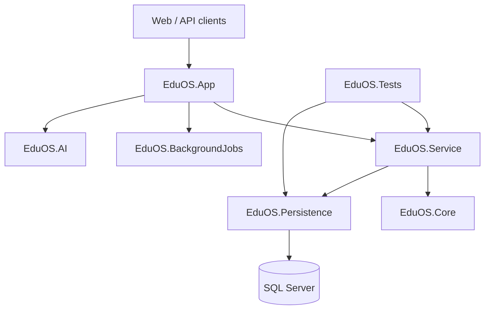

# EduOS

[](https://github.com/cseashrafulislam/EduOS/actions/workflows/ci.yml)

EduOS is a configurable, multi-tenant education SaaS platform being built for Bangladesh. Its long-term goal is to let primary schools, high schools, colleges, universities, coaching centres, training institutes, private education providers, and LMS operators run their complete academic and administrative lifecycle from one system.

An institution should eventually be able to sign up, choose a subscription, configure its own terminology and workflows, invite users, and start operating without code changes or specialist training.

> **Project status:** active foundation development. The repository contains a broad education domain model and the first security baseline, but it is not yet a complete or production-ready national education platform.

## Product vision

- One configurable platform for different types of education providers.
- Self-service signup, payment, onboarding, and module activation.
- Student, teacher, guardian, staff, and institution experiences in one ecosystem.
- No institution-specific business rule hard-coded into shared application logic.
- One privacy-preserving EduOS identity for a learner, with separate enrolments and records at each institution.
- Consent, legal authority, and an audit trail before any cross-institution information is shared.
- A modular architecture that can scale gradually without premature microservices.

## Current foundation

The solution currently includes domain foundations for:

| Area | Included foundations |
|---|---|
| SaaS platform | Tenants, subscriptions, invoices, payments, settings, and onboarding |
| Identity | ASP.NET Core Identity, JWT, roles, tenant context, and authorization |
| Academic | Academic years/terms, classes, sections, subjects, courses, and departments |
| Student lifecycle | Students, admission, attendance, examinations, and results |
| Operations | HR, payroll, finance, inventory, communication, transport, and hostel |
| Learning | LMS, library, and AI project foundations |
| Infrastructure | SQL Server, Redis integration, Hangfire, health checks, Swagger, and structured logging |

The presence of a domain or entity does not mean its full workflow and user experience are complete. New functionality is delivered end to end in reviewed phases.

## Architecture

EduOS currently follows a modular-monolith approach with clear project boundaries:



| Project | Responsibility |
|---|---|
| `EduOS.App` | MVC/API host, middleware, authentication, rate limiting, Swagger, and composition root |
| `EduOS.Core` | Domain entities, DTOs, enums, configuration models, and interfaces |
| `EduOS.Persistence` | EF Core context, mappings, repositories, migrations, and seed logic |
| `EduOS.Service` | Application services, validation, integrations, mapping, caching, and helpers |
| `EduOS.BackgroundJobs` | Scheduled and asynchronous job implementations |
| `EduOS.AI` | AI-specific application components |
| `EduOS.Tests` | Automated persistence, service, security, and business-rule tests |

## Security baseline

The current security baseline includes:

- Global tenant and soft-delete query filters.
- Deny-by-default tenant reads when no valid tenant context exists.
- Cross-tenant write protection during `SaveChanges`.
- Explicit platform/background access paths for reviewed cross-tenant operations.
- Encryption and API masking for tenant-owned SMTP and SMS secrets.
- Rate limiting for onboarding and payment callback endpoints.
- Payment amount and currency verification.
- Durable ASP.NET Core Data Protection support for multi-instance deployments.
- Production database initialization disabled by default.
- Automated tenant-isolation and secret-protection tests.

See [SECURITY.md](SECURITY.md) before configuring credentials or reporting a vulnerability.

### Student identity and privacy

A birth registration number or NID must never become a database primary key or a publicly searchable value. The planned global learner identity will use:

- An internal, non-meaningful EduOS identifier.
- Encrypted government identifiers.
- A keyed lookup index for controlled exact matching.
- Institution-specific enrolment and academic records.
- Consent and purpose-based access policies.
- Audited, time-limited privileged access.

No institution should automatically receive another institution's private student history merely because it knows an identifier.

## Prerequisites

- [.NET 10 SDK](https://dotnet.microsoft.com/download/dotnet/10.0)
- SQL Server 2019 or newer
- Redis for distributed production caching; a local Redis instance is optional during early development
- Git

## Local development

1. Clone and enter the repository:

   ```bash
   git clone https://github.com/cseashrafulislam/EduOS.git
   cd EduOS
   ```

2. Restore dependencies:

   ```bash
   dotnet restore EduOS.slnx
   ```

3. Configure local secrets. Do not put real credentials in `appsettings.json`:

   ```bash
   dotnet user-secrets --project EduOS.App set "ConnectionStrings:DefaultConnection" "Server=localhost;Database=EduOS;Trusted_Connection=true;TrustServerCertificate=true;"
   dotnet user-secrets --project EduOS.App set "JwtSettings:Secret" "replace-with-at-least-32-random-characters"
   ```

4. Add optional email, SMS, and payment credentials only when testing those integrations. The complete key list is documented in [.env.example](.env.example) and [SECURITY.md](SECURITY.md).

5. Start the application:

   ```bash
   dotnet run --project EduOS.App
   ```

In the current Development configuration, reviewed migrations and seed initialization run at startup. Production keeps automatic initialization disabled and requires migrations as a controlled deployment step.

When the Development profile is running, useful endpoints include:

- `/swagger` — API documentation
- `/health` — application health check
- `/hangfire` — authorized background-job dashboard

## Configuration

ASP.NET Core environment-variable nesting uses double underscores. Examples:

```text
ConnectionStrings__DefaultConnection
DataProtection__KeysPath
JwtSettings__Secret
EmailSettings__SenderEmail
EmailSettings__Password
SmsSettings__ApiKey
SmsSettings__ApiSecret
Payments__AamarPay__StoreId
Payments__AamarPay__SignatureKey
```

Production instances must store secrets outside Git and share a protected, durable Data Protection key ring. The sample `.env.example` is documentation only; values must be supplied through the deployment platform, container environment, user-secrets, or a managed secret store.

## Build and test

Run the same quality checks used by CI:

```bash
dotnet restore EduOS.slnx
dotnet build EduOS.slnx --configuration Release --no-restore
dotnet test EduOS.slnx --configuration Release --no-build
```

GitHub Actions runs these checks for pull requests targeting `master` and for pushes to `master`.

## Delivery workflow

1. Create a focused feature branch.
2. Implement one end-to-end workflow or a small group of related tables.
3. Add tests for security boundaries and business rules.
4. Confirm no secret or personal data was introduced.
5. Open a pull request and wait for CI before merge.

Repository-specific development rules are in [AGENTS.md](AGENTS.md).

## Roadmap

- [x] **Phase 0 — Security foundation:** tenant isolation, protected settings, payment validation, rate limiting, CI, and security guidance.
- [ ] **Phase 1 — SaaS core:** configurable institution types, campus/branch model, module catalogue, subscription entitlements, and self-service onboarding.
- [ ] **Phase 2 — Identity:** global person/learner identity, guardian relationships, consent, privacy policies, and institution enrolments.
- [ ] **Phase 3 — Academic operations:** configurable programmes, curriculum, scheduling, attendance, assessment, results, and certificates.
- [ ] **Phase 4 — Institution operations:** fees and accounting, HR/payroll, inventory, library, transport, hostel, communication, and LMS workflows.
- [ ] **Phase 5 — Scale and intelligence:** outbox/event processing, idempotent jobs, observability, partition strategy, search, analytics, and governed AI features.

## Important credential notice

If you cloned an older revision of this public repository, assume that any SMTP, SMS, or payment credential previously committed is compromised. Removing a secret from the latest file does not remove it from Git history. Revoke or rotate it with the provider before any deployment.
